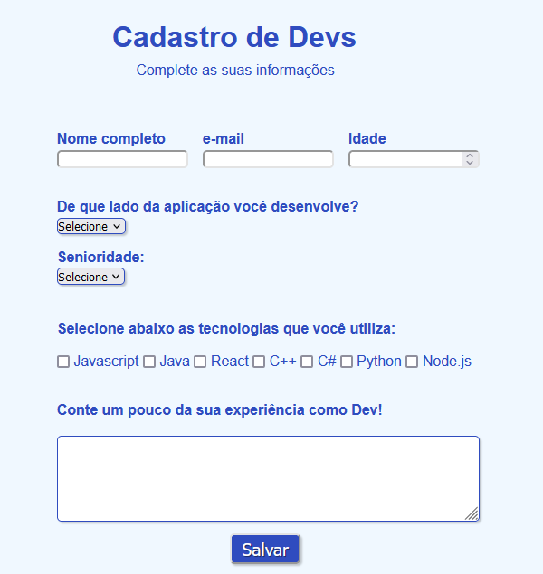

<h1 align="center"> 💻 Formulário de cadastro de DEVs </h1>

Projeto que visa praticar e reforçar todo conteúdo aprendido em HTML e CSS de nível básico/intermediário.

 

  <a href="#-tecnologias">Tecnologias</a>&nbsp;&nbsp;&nbsp;|&nbsp;&nbsp;&nbsp;
  <a href="#-projeto">Sobre o projeto</a>&nbsp;&nbsp;&nbsp;|&nbsp;&nbsp;&nbsp;
  <a href="#-aprendizados">Aprendizados</a>&nbsp;&nbsp;&nbsp;|&nbsp;&nbsp;&nbsp;
  <a href="#-contato">Contato</a>&nbsp;&nbsp;&nbsp;&nbsp;&nbsp;&nbsp;

 

    

 

  

## 🚀 Tecnologias

 

- HTML (Formulários)
- CSS 

 

## 💻 Projeto

 
O projeto consistiu em criar uma página de <u>Cadastro de Devs</u>, que solicitava ao usuário algumas informações bastante úteis, como: informações pessoais, nível de senioridade, tecnologias que usa no dia-a-dia e etc. 
  
Além disso, há aplicação do conteúdo aprendido em CSS para estilizar a landing page, tornando toda a experiência mais agradável ao usuário.
  
Utilizei como apoio uma video-aula da instrutora <strong>
<a target="_blank" href="https://www.youtube.com/watch?v=wwqOJ2o84S4">Rafa Ballerini</a></strong>, além do conteúdo aprendido no curso.
  
Você pode visualizar como ficou a página <strong><a href="https://jvinicius-ribeiro.github.io/formulario-html-css/" target="_blank">CLICANDO AQUI!</a></strong>

 

 

## 🏆 Aprendizados

Esse projeto foi interessante por possibilitar que pudesse aplicar as tags e conteúdos aprendidos no módulo de Formulários no curso <strong><a target="_blank" href="https://www.youtube.com/@DevemDobro">DevQuest</a></strong>.  Além de reforçar aprendizados de semântica (HTML), estilização (CSS) e clean-code. 
  

  <h2>👋 <u>Contato</u></h2> 
  

  
  

  

<h3 align="center">Obrigado pela sua visita! Estou aberto à sugestões e feedbacks =)</h3>

